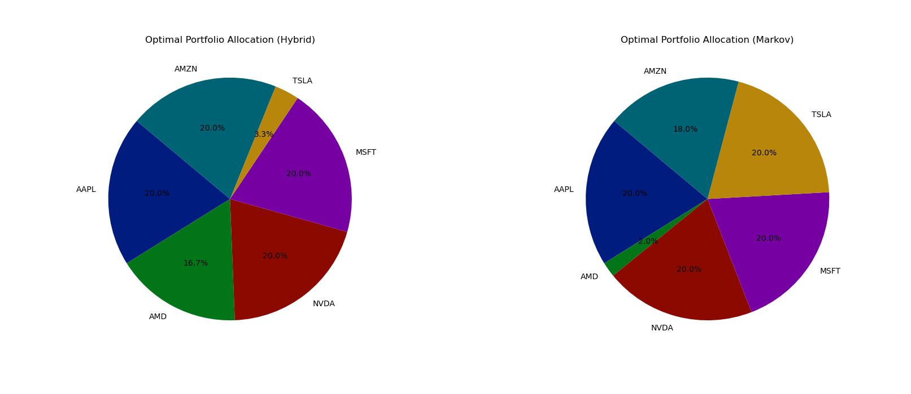
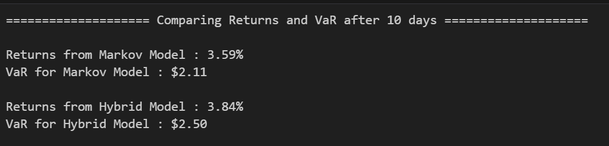

# A Monte Carlo simulation technique to determine the optimal portfolio -   `Hassan Ghodrati and Zahra Zahiri`

"Attempting to analyze the findings of the research article using a different dataset." 

## Results

#### 1. Weights of assets in a portfolio proposed by Hybrid Model and Markowitz Model

 

#### 2. Comparing Returns and Value at Risk(VaR) of both portfolios after 10 days 

 

## Methodology

#### 1. Calculated Value at Risk (VaR) using Monte Carlo simulation to estimate potential losses.
#### 2. Optimized portfolios applying Markowitz theory and a hybrid model proposed in the research paper, combining Markowitz & Winker-Maringer methods.
#### 3. Markowitz model focuses on mean and variance while Hybrid model integrates mean, variance, skewness, and kurtosis.
#### 4. Constructed and assessed portfolios for both models over a 10-day period to analyze performance.
#### 5. Findings: Markowitz model achieved a 3.59% return with a VaR of $2.11, while the Hybrid model achieved a 3.84% return with a VaR of $2.50. 

