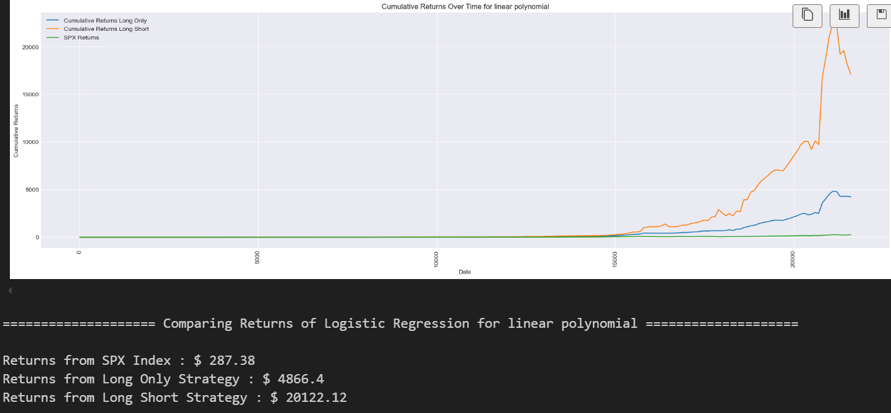
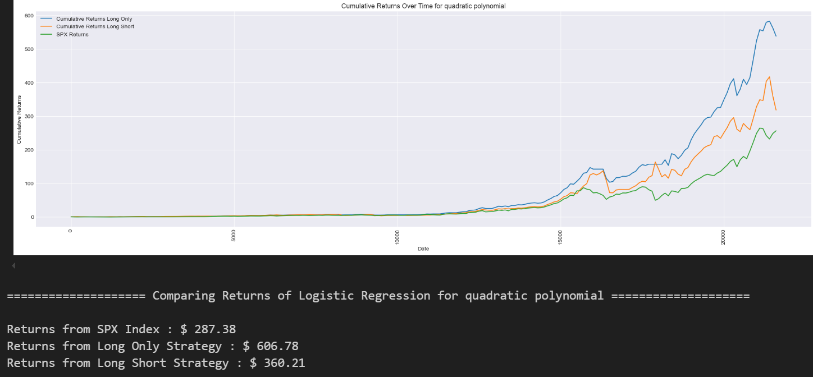
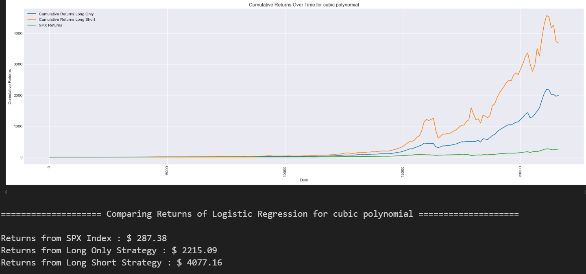
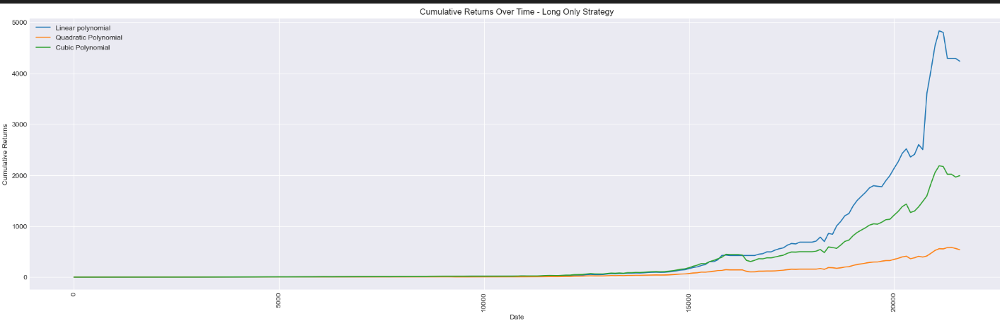
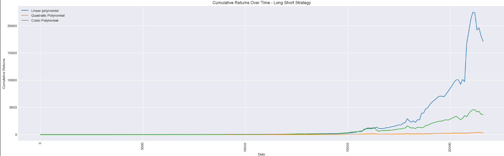

# Applying Machine Learning to Trading Strategies: Using Logistic Regression to Build Momentum-based Trading Strategies 

### Summary:

1. The S&P 500 index data from 1930 to 2018 is considered.
2. Features are derived from momentum and drawdown across various time frames.
3. Three different data frames are created, with features represented as linear, quadratic, and cubic polynomials.
4. Each of these data frames is individually trained using a logistic regression algorithm over an 8-year sliding window for both long-only and long-short strategies.
5. The performance of the three data frames is compared, with the linear polynomial model outperforming the quadratic and cubic models.
6. Returns from the long-only strategy exceed those from the long-short strategy across all three data frames.

### Results:

1. Linear Polynomial

 

2. Quadratic Polynomial

3. Cubic Polynomial

 

4. Long Only 

 

5. Long Short

 